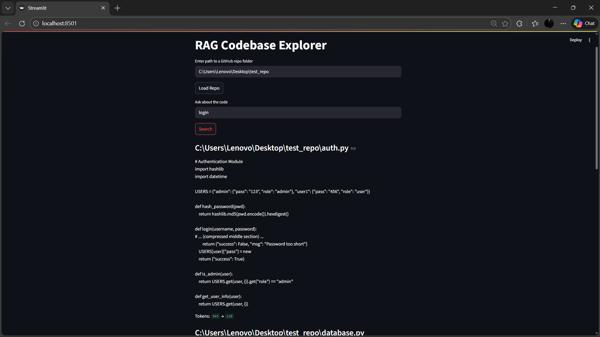

# 📸 Screenshot Checklist for GitHub/Portfolio

Take these **6 essential screenshots** based on what's currently working in your app.

---

## ✅ Required Screenshots (Take These Now!)

### 1. **01_main_interface.png**
**Capture:**
- The main Streamlit interface
- Title: "RAG Codebase Explorer"
- Empty input fields
- Clean, professional look

**How:** 
- Refresh the page to get clean state
- `Win + Shift + S` → capture full window

---

### 2. **02_loading_repo.png**
**Capture:**
- Path entered: `C:\Users\Lenovo\Desktop\test_repo`
- Click "Load Repo" button
- Show "Files found: 2" message

**How:**
- Enter the path
- Take screenshot BEFORE clicking Load

---

### 3. **03_compression_working.png** ⭐ MOST IMPORTANT
**Capture:**
- The EXACT screen you just showed me!
- Query: "login"
- Results showing:
  - `auth.py` with tokens **393 → 138**
  - `database.py` 
  - The `# ... (compressed middle section) ...` marker visible

**Why:** This proves your compression and RAG are working!

---

### 4. **04_query_database.png**
**Enter query:** `"Which files handle database queries?"`
**Click Search**
**Capture:**
- Results showing `database.py` at the top
- Token stats visible
- Compressed code showing

---

### 5. **05_query_authentication.png**
**Enter query:** `"How is authentication implemented?"`
**Click Search**
**Capture:**
- Results showing `auth.py` 
- Functions like `login()`, `hash_password()` visible
- Token reduction shown

---

### 6. **06_token_statistics.png**
**Capture:**
- Close-up of the token statistics
- Show multiple files with:
  - Original tokens (green)
  - Compressed tokens (green)
  - Clear compression ratio

**How:**
- Zoom in or crop to focus on "Tokens: XXX → YYY"

---

## 🎯 Optional But Impressive

### 7. **07_success_message.png**
**Capture:**
- The green success message: "Loaded X files"
- Shows the system works end-to-end

### 8. **08_architecture_diagram.png**
**Capture:**
- Open `docs/architecture.md` in VS Code
- Screenshot the ASCII flowchart section
- Shows system design understanding

---

## 💾 Where to Save

Save all screenshots to:
```
C:\Users\Lenovo\Desktop\rag-codebase-explorer\docs\Screenshots\
```

**File naming:**
- `01_main_interface.png`
- `02_loading_repo.png`
- `03_compression_working.png`
- `04_query_database.png`
- `05_query_authentication.png`
- `06_token_statistics.png`

---

## 🚀 After Taking Screenshots

### Add to README:
```markdown
## 📸 Demo


*Query results showing 65% token compression (393 → 138 tokens)*


*Natural language code search in action*
```

### Git commands:
```bash
git add docs/Screenshots/*.png
git commit -m "Add demo screenshots"
git push
```

---

## ✅ Quick Checklist

- [ ] Main interface (clean homepage)
- [ ] Loading repo screen
- [ ] **Compression working (393 → 138)** ⭐
- [ ] Database query results
- [ ] Authentication query results  
- [ ] Token statistics close-up
- [ ] (Optional) Success message
- [ ] (Optional) Architecture diagram

---

**Focus on screenshot #3 - that's your proof of working compression!** 🎉
